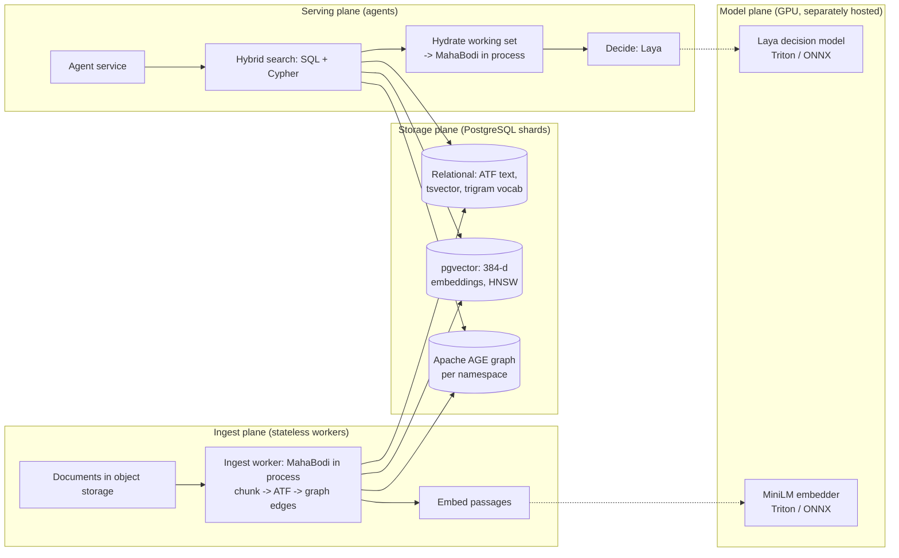
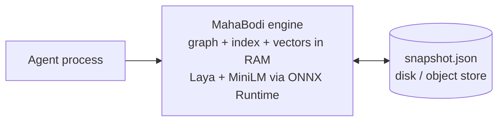
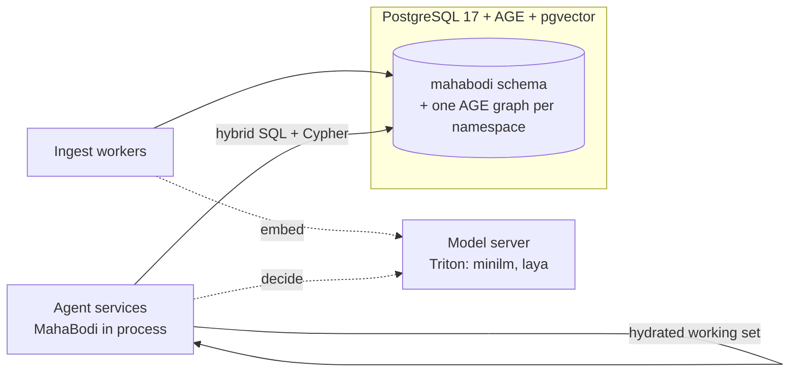
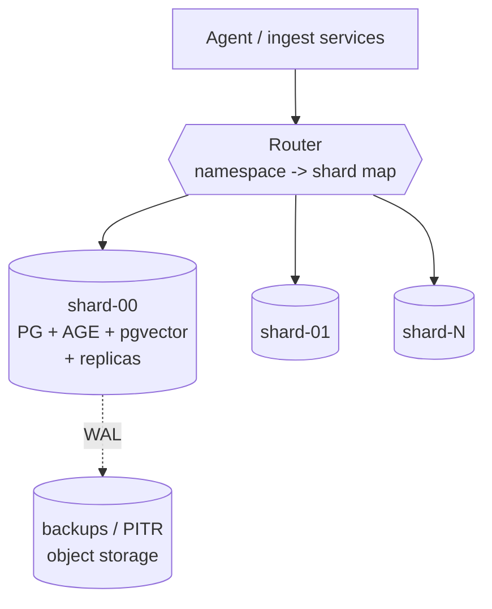
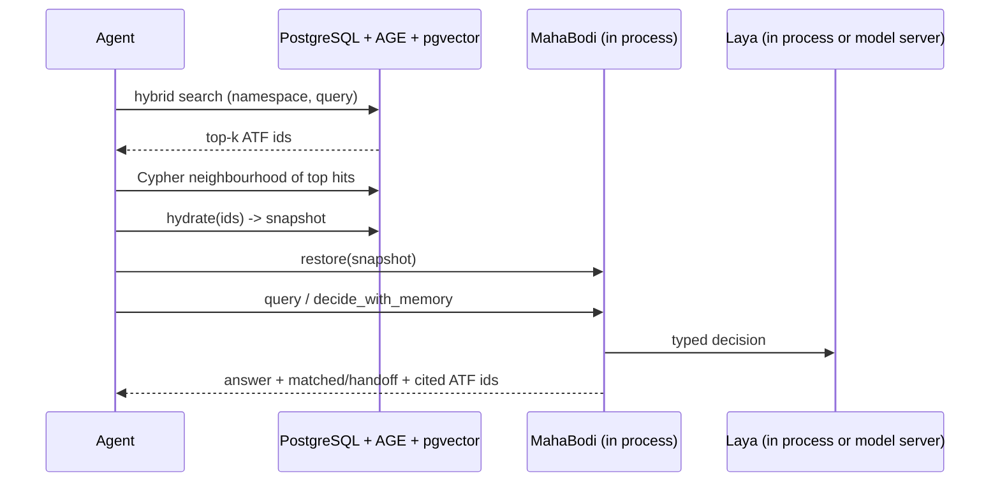

# MahaBodi for the enterprise: TB–PB memory on PostgreSQL + Apache AGE, with separately hosted models

This document explains how to run MahaBodi, which combines fastmemory topology memory with Laya
typed decisions, when memory grows to terabytes or petabytes. Memory lives in **PostgreSQL + Apache
AGE** (plus pgvector and pg_trgm), and the models run on **separate model servers**.

It is a reference architecture with tested building blocks. It is **not** a description of a
finished product. Section 1 lists what exists today, what was tested for this document, and what
still has to be built. Every number here was measured on the machine described in
section 7 or comes from `BENCHMARKS.md`. Numbers extrapolated to TB/PB are labelled as
extrapolations.

---

## 1. Status: what exists, what was tested, what is not built

| Piece | Status | Evidence |
|---|---|---|
| MahaBodi engine (Rust core; Python, Node, Java, C#, Go bindings) | **Exists.** Memory is held **in process** (RAM); persistence is `snapshot()` / `restore()` JSON | `scripts/test_all.sh`: 7/7 suites pass (macOS x86_64) |
| Laya + MiniLM inference | **Exists, in process** (ONNX Runtime linked into the engine) | Laya parity tests (`crates/mahabodi-core/tests/laya_parity.rs`) |
| PostgreSQL + AGE + pgvector + pg_trgm schema | **Tested here** on PostgreSQL 17.7, AGE 1.7.0, pgvector 0.8.0 | `deploy/postgres/01_schema.sql`, `deploy/postgres/test_store.py` (all checks pass) |
| Snapshot → store sync, SQL hybrid search, Cypher neighbourhood, hydration back into MahaBodi | **Tested here** as a Python reference module (`deploy/sync/mahabodi_pg.py`), outside the engine | `test_store.py` |
| Model-server configs for Laya and MiniLM (NVIDIA Triton) | **Checked** against the real ONNX files (names, dtypes, ranks). **Not run**: no GPU/Triton on the test machine | `deploy/models/check_model_configs.py` → PASS |
| `docker-compose.yml` (pattern P2) | **Validated** with `docker compose config`. **Not run**: no Docker daemon on the test machine | `deploy/compose/` |
| Postgres image (`deploy/postgres/Dockerfile`) | **Not built** here; the same extension versions were tested natively | — |
| Kubernetes manifests (patterns P3/P5) | **Schema-validated** with `kubeconform -strict` (Kubernetes 1.30). **Not deployed** | `deploy/k8s/` |
| MahaBodi reading/writing Postgres directly (a storage backend inside the engine) | **Not built** | — |
| MahaBodi calling a remote model server instead of in-process ONNX Runtime | **Not built** | — |
| Distributed (multi-node) AGE graph | **Not used.** This design shards at the application level (section 4, P3) | — |

---

## 2. Why the in-process engine alone does not reach TB/PB

The facts, from the code and the benchmarks:

* **Memory is in RAM.** The graph, lexical index and dense vectors live in the engine process
  (`crates/mahabodi-core/src/memory.rs`), so memory size is capped by one machine's RAM.
* **Every ingest rebuilds.** `ingest` / `ingest_batch` rebuild the graph, the index and Louvain
  communities over the whole memory. `ingest_batch` rebuilds once per batch rather than once per
  document, but it is still a full rebuild.
* **Retrieval quality falls as memory grows.** On held-out SQuAD questions (`BENCHMARKS.md`,
  `research/results/retrieval_{300,2000}.json`), MahaBodi hybrid retrieval scores:

  | Memory size | recall@5, clean questions | vs BM25 | confidently wrong, clean | confidently wrong, misspelled keywords |
  |---|---|---|---|---|
  | 300 paragraphs | 0.973 | beat (p = 0.004) | 2.7 % | 35.2 % |
  | 2,000 paragraphs | 0.930 | tie (p = 0.07) | 7.0 % | 58.5 % |

  A flat search over billions of passages would be far worse. **Design rule: keep the searched
  space small.** Scope every query to a namespace (tenant or domain), apply filters first, and
  hydrate a small working set for the in-process engine (pattern P4).

---

## 3. Architecture

Four planes, each scaled independently:

### 3.1 Data model (`deploy/postgres/01_schema.sql`)

| MahaBodi concept | Store |
|---|---|
| ATF (function/passage) with `action`, `input`, `logic`, `access`, `events`, `data_connections` | row in `mahabodi.atf`, key `(namespace, id)`; hash-partitioned by namespace |
| passage text (`texts[id]`) | `atf.body`, plus a generated `tsvector` (GIN) for lexical search |
| dense vector (MiniLM, 384-d) | `mahabodi.atf_embedding` (pgvector, HNSW, cosine) |
| typo-correction vocabulary | `mahabodi.vocab` (pg_trgm GIN) |
| topology: `F_`, `D_`, `A_`, `E_`, `K_` nodes and their edges | an AGE graph `mb_<namespace>`: vertex labels `Function`, `Data`, `Access`, `Event`, `Concept`; edge labels `USES`, `GRANTS`, `EMITS`, `LINKS`, `MENTIONS` |

**ATF ids are unique per source, not globally.** The five fastmemory example files all reuse
`ATF_S_0…19`. Every key in the store is therefore `(namespace, id)`.

**AGE needs explicit indexes.** AGE creates no index on vertex properties or edge endpoints. Without
them, `MATCH (f:Function {id: x})` is a sequential scan, and a bulk `MERGE` load grows
quadratically: loading 2,000 prose ATFs had not finished after 8 minutes. `create_namespace()`
therefore creates a GIN index on `properties` for every vertex label, and B-tree indexes on
`start_id` / `end_id` for every edge label. The query plan then uses a bitmap index scan.

### 3.2 Query path

The SQL/Cypher side mirrors MahaBodi's own cascade (`deploy/sync/mahabodi_pg.py`):

1. **Typo correction.** Each query term not in the namespace vocabulary is mapped to its closest
   known term by trigram similarity (pg_trgm). Tested: `anlyst` → `analyst`.
2. **Lexical search.** `tsvector` search over id, action and passage text.
3. **Dense search.** pgvector cosine distance over MiniLM vectors.
4. **Fusion.** The ranked lists are combined by reciprocal rank (the same fusion MahaBodi's hybrid mode uses).
5. **Neighbourhood.** A Cypher query adds ATFs that share a Data/Access/Event/Concept node, or a
   `LINKS` edge, with the top hits.
6. **Hydration.** These ATFs become a MahaBodi snapshot. `Bodi.restore()` loads it, and the
   in-process engine answers with its full cascade, handoff flags and Laya decisions.

In the tests, hydrated engines answered every probe query from their working set (section 7).

---

## 4. Deployment patterns

### P1 — Embedded (what exists today)

One process per agent or service. Memory is in RAM and persisted with `snapshot()` to local disk
or object storage.

* **Use when:** a memory fits in one machine's RAM and ingest volumes are modest (full rebuild per batch).
* **Limit:** RAM, rebuild time, and the retrieval-quality fall-off with memory size shown in section 2.

### P2 — Single store node + model server (GBs to low TBs)

* **Artefacts:** `deploy/compose/docker-compose.yml`, `deploy/postgres/Dockerfile`,
  `deploy/models/triton/*`.
* The dotted arrows to the model server are the **remote model client that is not built yet**.
  Today MahaBodi runs both models in process, which also works in P2.

### P3 — Sharded by namespace (TBs to PBs)

An AGE graph lives inside one database, so sharding is done by the application. A namespace
(tenant or domain) lives wholly on one shard, and a router maps namespaces to shards.

* **Artefacts:** `deploy/k8s/memory-shard.yaml` (one StatefulSet per shard) and
  `deploy/k8s/router-config.yaml` (shard map with explicit placement for large tenants and hashing
  for everyone else).
* **Rebalancing:** move a namespace by copying its rows and graph to the target shard, flipping the
  map entry, then dropping the source. Hash partitions of `atf` keep per-namespace data physically
  grouped.
* **Cross-namespace queries** are a fan-out plus a merge in the router. This design does not
  provide global search over all of a petabyte, on purpose (see section 2).

### P4 — Tiered: shared store + in-process working set (recommended for agents)

The shared store holds everything. Each agent works on a small, relevant working set, which is
where MahaBodi's cascade and handoff signals behave best (section 2). This whole loop is exercised
by `deploy/postgres/test_store.py`.

### P5 — Model hosting options

| Option | How | When |
|---|---|---|
| In process (exists) | ONNX Runtime inside MahaBodi; Laya 1.6 GB (English) / 1.2 GB (multilingual), MiniLM 86 MB | CPU-only, low QPS, or strict data locality |
| Sidecar | A model server in the same pod, over localhost gRPC | Share a GPU across agent processes on one node |
| Central GPU pool | `deploy/k8s/model-server.yaml`: Triton Deployment + HPA | High QPS; models upgraded independently of agents |

For Laya, tokenization and sequence building stay in the client. MahaBodi's `system1::sequence`
already reproduces Laya's exactly, and parity is tested. The server runs only the fused graph:
inputs `input_ids`, `attention_mask`, `marker_pos`, `marker_mask`, `qtype`; outputs `logits`,
`act_logits`, `pooled`.

---

## 5. Sizing (measured, then extrapolated)

**Status: not yet measured at a meaningful size.** A 2,000-paragraph SQuAD run loaded all 4,897
ATFs into the store. It was then stopped, and its database deleted, when the test machine ran out
of disk; the measurements below are therefore not available yet. What *was* measured:

| Quantity | Measured | Notes |
|---|---|---|
| store bytes per ATF, 20-ATF fixture | 43.9 KB | dominated by fixed overhead (16 partitions, per-label AGE tables and indexes); **not** a per-ATF cost to extrapolate from |
| raw passage text per ATF | 327 B (fixture), 318 B (SQuAD: 1.56 MB / 4,897 ATFs) | |
| MiniLM embedding throughput, CPU, one process | 6–18 passages/s | on a machine at load average 150–550 (other benchmarks running); a lower bound only |
| SQL hybrid search latency p50 | 10–16 ms | fixture sizes |
| Cypher neighbourhood latency p50 | ~1.25 s | 20-ATF fixture on the loaded machine; AGE `UNWIND … MATCH` per seed. Too slow for interactive use as written; needs profiling |

Scaling problems found and fixed while building the test (both fixed in the artefacts):

1. **AGE has no property indexes.** Loading 2,000 prose ATFs had not finished after 8 minutes;
   `create_namespace()` now adds GIN indexes on `properties` and B-tree indexes on edge endpoints.
2. **Hub vertices explode neighbourhood queries.** In prose memories, `data_connections` are
   content terms, and a common term links thousands of ATFs. A 2-hop query through such a term
   touched most of the graph and ran for more than 20 minutes on 4,897 ATFs. The load step now
   stores each shared vertex's degree (`df`), and `neighbourhood()` skips vertices above a cap
   (default 25).

To finish this section: rerun `deploy/postgres/test_store.py --paragraphs-file …` with at least
100k ATFs on an idle machine with enough disk (budget ≥ 10× the raw corpus for temporary files).

The extrapolation method (linear in ATF count; indexes that grow sub-linearly are counted linearly,
which is conservative):

* ATFs for a corpus ≈ corpus text bytes / text bytes per ATF.
* Store size ≈ ATFs × store bytes per ATF.
* Embedding time ≈ ATFs / (passages per second per GPU × GPUs). CPU figures here are a lower bound.

---

## 6. Accuracy, hallucination and near-ties: what grounding does and does not guarantee

Laya and MahaBodi do not generate text. They choose among given options, so they cannot invent
facts in the generative sense. They can still be **confidently wrong**. Laya's own README reports
0.000 accuracy at 0.952 confidence on Khmer for the English checkpoint.

Grounding decisions in memory helps only when retrieval returns the right memory. The measured
facts:

* Retrieval returns a **confidently wrong** passage for 2.7–35 % of queries at 300 paragraphs, and
  7–59 % at 2,000, depending on query style (section 2, `BENCHMARKS.md`).
* **Memory-grounded decisions, measured** (`research/results/bench_grounding.json`: BoolQ, the
  500 `BENCHMARKS.md` items; memory holds the 500 test passages, 962 ATF records after chunking,
  so each question's own passage is in memory: a relevant knowledge base, not open-domain):

  | Arm | Accuracy | Confidently wrong (conf ≥ 0.8) |
  |---|---|---|
  | question only (Laya, no context) | 0.424 | 44.8 % |
  | always answer "yes" (majority class) | 0.626 | — |
  | grounded, v1 format (labelled context under `memory`) | 0.656 | 14.4 % |
  | **grounded, v2 format (top-3 passages as `passage`, first)** | **0.782** | **16.6 %** |
  | the correct passage given directly (oracle) | 0.846 | 11.0 % |

  The v2 format was chosen on a disjoint dev sample (`tune_grounding.json`, BoolQ validation
  items 500–999) and run once on the test items (`bench_grounding_v2.json`). Against the test
  items, the v2 grounded arm:

  * **beats** no context (235 vs 56 discordant, p = 3e-27);
  * **beats** always answering "yes" (127 vs 49, p = 4e-9), which v1 did not (p = 0.27);
  * still **loses** to the oracle passage (26 vs 58, p = 6e-4).

  When retrieval found the right passage (463 of 500 items), grounded accuracy is 0.790 against
  0.840 for the oracle on the same items; v1 had a gap of about 17 points. When retrieval
  returned a wrong passage (37 items), it scores 0.676, still above no context (0.514).
  Grounding therefore lifts Laya a long way and cuts confidently-wrong answers about threefold
  compared with no context, but it does not eliminate them.
* **Experience memory** (a different mechanism: kNN over labelled examples, not the fastmemory
  graph) significantly improves on Laya zero-shot on emotion, banking77, sst5 and
  prompt_injections. But it is not significantly better than a plain kNN over the same examples
  (`BENCHMARKS.md`).
* **Near-ties** (Laya's top-two probability gap < 0.10): memory resolves many of them, but here
  "memory" means **experience memory** (labelled examples), not the fastmemory graph. On the
  `BENCHMARKS.md` test items (Laya probabilities recomputed; 2,000/2,000 predictions identical
  to the saved Laya runs):

  | Suite | near-tie items | Laya | Laya + experience memory | McNemar p | kNN memory alone |
  |---|---|---|---|---|---|
  | banking77 | 58 | 0.259 | **0.914** | 7e-12 | 0.914 |
  | sst5 | 85 | 0.176 | **0.329** | 0.015 | 0.435 |
  | emotion | 12 | 0.417 | 0.750 | 0.22 (too few items) | 0.583 |
  | ag_news | 6 | 0.167 | 0.667 | 0.25 (too few items) | 0.500 |

  Near-ties are where Laya is weakest (17–42 % accurate), and labelled memory significantly fixes
  them on banking77 and sst5. On near-ties the plain kNN over the same examples does as well (or,
  on sst5, better), so the gain comes from the labelled examples. **Whether the fastmemory
  document graph resolves near-ties (`decide_with_memory`) has not been measured.**

What the enterprise design can guarantee is **traceable grounding, not correctness**:

1. Every answer can carry the ATF ids, namespace and `source` (document URI) it was grounded on.
   `mahabodi.atf.source` stores the URI.
2. Every retrieval carries `matched`, `handoff`, `stage` and confidence. Agents should treat
   `handoff = true` as "escalate or ask", never as an answer.
3. Every decision can be audited later against the stored passages.

---

## 7. How the artefacts were tested

Test machine: macOS x86_64, Intel i9-9980HK, PostgreSQL 17.7 (Homebrew build, run as a separate
throwaway cluster), Apache AGE 1.7.0, pgvector 0.8.0 (built from source), Python 3.11,
psycopg 3.3.6, MahaBodi at the repository HEAD.

| Artefact | Command | Result |
|---|---|---|
| Schema, sync, search, neighbourhood, hydration | `DSN=... ./deploy/postgres/test_store.sh` (runs `test_store.py`) | robotics fixture: 6/6 checks pass. SQL hybrid search finds the source ATF in the top 5 for 20/20 probes; hydrated engine answers 20/20; typo `anlyst` → `analyst` |
| Triton configs vs ONNX | `python deploy/models/check_model_configs.py` | PASS: 12/12 inputs/outputs match (names, dtypes, ranks) |
| Compose file | `docker compose -f deploy/compose/docker-compose.yml config` | valid |
| Kubernetes manifests | `kubeconform -strict -kubernetes-version 1.30.0 deploy/k8s/*.yaml` | 7 resources, 7 valid |

Not tested: building the Docker image, running Triton, deploying to Kubernetes, and any multi-node
or TB-scale run.

---

## 8. Operations checklist

* **Backups:** WAL archiving with point-in-time recovery per shard (e.g. pgBackRest to object storage).
* **Embedder changes:** `atf_embedding` is keyed by `model`. Write new vectors next to the old
  ones, switch queries, then drop the old rows. Never mix vectors from different models in one index.
* **Model versioning:** pin the Laya checkpoint and ONNX export per deployment. Rerun
  `crates/mahabodi-core/tests/laya_parity.rs` against each new export before rollout.
* **Tenancy:** one namespace per tenant or domain. The namespace is also the unit of placement,
  backup restore and deletion.
* **Telemetry:** fastmemory's Python package and CLI send hostname, CPU id and IP to
  `api.fastbuilder.ai` on every call (verified in its `telemetry.rs`). MahaBodi's Rust core does
  not call those paths. Don't run the fastmemory Python package in production without egress
  control.

---

## 9. What would have to be built for a production TB/PB deployment

1. **A storage backend inside MahaBodi** (a Postgres adapter behind the `Memory` API), so the engine
   reads and writes the store directly instead of through snapshot/hydration.
2. **A remote model client** (Triton gRPC) behind the same interface as the in-process ONNX runtime.
3. **An incremental topology.** Louvain communities are recomputed per namespace or per hydrated
   working set today. A TB-scale namespace needs incremental or partitioned clustering.
4. **A bulk loader** using `COPY` for the relational tables and AGE's
   `load_labels_from_file` / `load_edges_from_file` for the graph, instead of batched `MERGE`.
5. **Scale tests:** load, query latency and retrieval quality at 10⁶–10⁹ ATFs per shard, measured
   rather than extrapolated.
