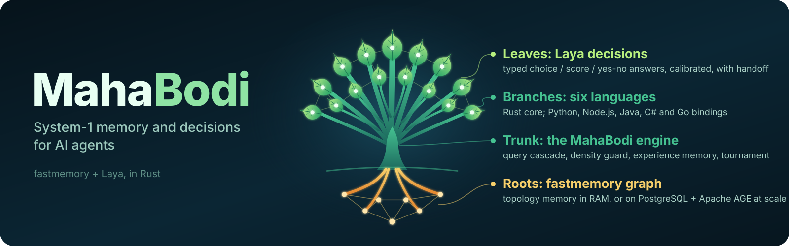

<p align="center">
  
</p>

# MahaBodi

**Memory-driven System-1 decisions for AI agents, built for large option sets.** Agents make
many small decisions: which of 150 intents, which tool, whether a ticket matches a known issue,
whether a policy passage answers yes. With a handful of options, you can prompt an LLM. With
hundreds of options, plus the company knowledge needed to choose between them, the prompt gets
long, slow and expensive, and every new label makes it worse. MahaBodi is built for that case:
typed decisions over **many choices, yes/no questions (nouls) and routing**, informed by a
memory of your documents and past labelled decisions, in one forward pass with no text
generated.

* **Decisions** – [Laya](https://github.com/NandhaKishorM/laya)'s calibrated `choice` /
  `score` / `noul` decision model, executed natively in Rust through ONNX Runtime.
  **Tournament shortlisting** handles large option sets (77 to 150 intents measured below);
  a non-Latin script guard and an answer cache are included.
* **Memory** – [fastmemory](https://github.com/fastBuilderAI/memory)'s topology memory
  (ATFs clustered into blocks by Louvain), with a **concept-density guard** and a hybrid
  **query cascade** that reports how, and whether, every query matched. Decisions can be
  **grounded** in retrieved passages, and **experience memory** learns from labelled cases
  instantly, with no retraining.
* **Enterprise path** – memory on PostgreSQL + Apache AGE + pgvector, sharded by namespace,
  with models hosted separately ([Enterprise.md](Enterprise.md)).

The core is Rust (`crates/mahabodi-core`), with bindings for **Python, Node.js, Java, C#/.NET
and Go** plus a C ABI.

> **What is and isn't measured yet.** Measured: many-option routing (Banking77, 77 intents;
> CLINC150, 150 intents), learning from labelled cases, and yes/no answers grounded in memory.
> Not yet measured: accuracy against an LLM given every option in its context (the claim here is
> cost and latency: one forward pass, zero tokens); tool routing across hundreds of tools;
> memory beyond 2,000 paragraphs (at that size, retrieval only ties BM25); the PostgreSQL design
> at TB scale (tested end to end at small scale only); and out-of-scope detection. A
> names-similarity gate tuned at the test prevalence raises out-of-scope recall to ~72 % on fresh
> CLINC150 items. It is built into `decide()` as an opt-in option
> (off by default); product parity on the final build is pending.

> Status: pre-release, built from source only. Nothing is published to PyPI, npm, crates.io,
> Maven Central, NuGet or the Go proxy yet. crates.io publishing is blocked until fastmemory
> releases `cluster::run_louvain_inline` (MahaBodi currently pins fastmemory to git rev
> `a7dec441`).

## Benchmark highlights

Every figure below is from [BENCHMARKS.md](BENCHMARKS.md): same machine, same Laya checkpoint on
both sides, seeded test samples (n = 500 per suite unless noted), and an exact McNemar test on
the same items. A result counts as a **beat** only at p < 0.05.

### At a glance

| Result | Laya (or baseline) | MahaBodi | Verdict (exact McNemar) |
|---|---|---|---|
| MASSIVE intent, 51 languages, zero-shot | 0.366 macro, 45/51 languages usable | **0.405 macro, 47/51 usable** | **beat**, p < 1e-6 |
| Banking77 (77 intents), zero-shot | 0.492 | **0.660** | **beat**, p < 1e-6 (tie vs Laya + MiniLM shortlist) |
| Banking77 with 2,000 labelled examples, default settings, fresh items | 0.462 (zero-shot) | **0.832** | **beat**, different setting; a plain kNN over the same examples scores 0.892: **loss** |
| Banking77 with 2,000 labelled examples, opt-in `calibrate=200`, third fresh sample | 0.446 (zero-shot); plain kNN 0.876 | **0.882** | **beat** Laya; **ties** kNN (p = 0.63) |
| Experience memory, default, 5 suites, fresh items | Laya zero-shot | no suite below Laya | 3 beats, 2 ties |
| Misspelled keyword retrieval (SQuAD, 300 paragraphs) | baseline BM25: 0.05 recall@5 (Laya does no retrieval) | **0.61** | **beat** |
| CLINC150 intent routing (150 intents + out-of-scope), zero-shot | 0.708 (Laya + MiniLM shortlist); Laya alone 0.538 | **0.736** | **beat**, p = 0.027 (one run, 1,000 items); out-of-scope recall only 3 % in that run |
| CLINC150 re-test on fresh items, with the same out-of-scope gate given to every system | 0.756 (Laya + MiniLM shortlist + gate) | **0.786** | **beat**, p = 0.014; the gate lifts out-of-scope recall to 68–72 % for **all** systems (measured as a recipe in the benchmark; now an opt-in `decide()` option, parity pending) |
| BoolQ answered from memory (question only in, passage retrieved) | 0.424 (question only); always-yes 0.626 | **0.782** | **beat** both, p < 1e-6; below the oracle passage (0.846) |
| 6 other Laya suites, zero-shot | = | = | tie: exact parity |
| Calibration (ECE after the same temperature refit), 6 suites | Banking77 0.159 | Banking77 **0.050** | **beat** on Banking77 only (tournament); tie on 5 |

Zero-shot scorecard against Laya's 10 published benchmarks: **2 beats, 6 ties, 1 not yet run**
(idle-machine latency). Calibration (ECE) is scored per suite: better on Banking77 only, where the
tournament changes the predictions, and identical on the other 5. MahaBodi runs Laya's own models: the wins come
from how MahaBodi uses them (tournament shortlisting, experience memory, retrieval), not from a
new model.

**1. Multilingual, zero-shot: MahaBodi beats Laya on Laya's own 51-language benchmark.** On
MASSIVE intent (20 options, 100 utterances in each of 51 languages, Laya's own construction),
with the `laya-multilingual` checkpoint on both sides:

| | Laya | MahaBodi |
|---|---|---|
| macro accuracy | 0.366 | **0.405** |
| languages above 3× random | 45 / 51 | **47 / 51** |

The difference is significant: exact McNemar over all 5,100 items, 541 vs 344 discordant,
p < 1e-6. The Laya column reproduces Laya's published figures exactly (0.366 and 45/51). The gain
comes from tournament shortlisting, whose settings were fixed on English Banking77 and not tuned
on MASSIVE. Its cost is 4 model passes per decision, against Laya's 1. [Details](BENCHMARKS.md#massive-intent-20-options-per-language-laya-multilingual-checkpoint-on-both-sides)

**2. Many-option decisions, zero-shot: +16.8 points over Laya on Banking77.** On 77 intents,
MahaBodi's tournament shortlisting scores **0.660 against Laya's 0.492** (p < 1e-6). It also
beats two of Laya's own documented mitigations: a 512-token head budget (0.564) and shortlisting
with Laya's encoder (0.268). It **ties** Laya's shortlist with a MiniLM embedder (0.642, p = 0.30),
which is also faster. [Details](BENCHMARKS.md#banking77-mahabodi-vs-layas-own-many-option-mitigations)

**3. Exact Laya parity, natively in Rust.** On the other six published suites MahaBodi
reproduces Laya's decisions item for item: typed-decisions 0.766, AG News 0.934, Emotion 0.604,
SST-5 0.350, prompt-injections 0.698, BoolQ 0.846, with zero disagreements. These are ties by
construction, not wins. [Details](BENCHMARKS.md)

**4. Experience memory: learning from labelled examples without retraining.** Given 2,000
labelled examples per task (a different setting from zero-shot), the **default** MahaBodi
matches or beats Laya everywhere it was tested on fresh data: **no loss on any of five suites**.
Memory changes an answer only when Laya is unsure, or when nearly all similar stored cases agree
and the task's memory has proven reliable. A plain kNN over the same examples is **still better
on Banking77**.

Fresh test items (500 per suite, never scored before; defaults `experience_override_agree` 6):

| Suite | Laya (zero-shot) | MahaBodi default + memory | plain kNN on same examples |
|---|---|---|---|
| Banking77 | 0.462 | **0.832** (beat, p < 1e-6) | 0.892 (**MahaBodi loses**, p < 0.001) |
| Emotion | 0.574 | **0.612** (beat, p = 0.009) | 0.590 (tie) |
| SST-5 | 0.334 | **0.392** (beat, p = 0.005) | 0.370 (tie) |
| AG News | 0.916 | 0.920 (tie) | 0.892 (MahaBodi beats) |
| BoolQ | 0.838 | 0.836 (tie) | 0.648 (MahaBodi beats) |

prompt-injections was not fresh-tested (its 116 test items were all used earlier). With
settings tuned per task instead of one default, the first test set (items 0–499) gives Banking77
0.888, Emotion 0.668, SST-5 0.430 and prompt-injections 0.767, all against Laya's 0.492, 0.604,
0.350 and 0.698. [Details](BENCHMARKS.md#with-experience-memory-a-different-setting-uses-labelled-examples),
[fresh test](BENCHMARKS.md#fresh-sample-test-margin-gate-and-agreement-override-items-never-scored-before)

**Opt-in: `learn(..., calibrate=200)` closes the Banking77 gap.** MahaBodi runs Laya on 200 of
the labelled cases and compares it with the memory's own leave-one-out accuracy. Where memory is
clearly better, it answers from memory. On a third fresh sample (500 new items per suite) it was
**never below Laya or plain kNN on any of 5 suites**: 3 beats and 2 ties against each. On
Banking77 it **matches** kNN (0.882 vs 0.876, p = 0.63) by answering every item from the memory's
kNN. This is MahaBodi switching to kNN where calibration shows kNN is better, not a new method
beating kNN.
- The switching margin (0.2) was picked after seeing the validation grid, for robustness, and was
  fixed before this test.
- prompt-injections was not fresh-tested.
- The AG News and BoolQ tuning items come from Laya's training mix.
- Calibration costs 200 extra decisions per `learn()` and is **off by default**. Without it,
  Banking77 stays at 0.806, below kNN.

[Details](BENCHMARKS.md#opt-in-calibration-learn-calibrate200-third-fresh-sample-items-never-used-before)

**5. Breaking Laya's near-ties.** When Laya's top two options are within 0.10 of each other it
is only 17–42 % accurate. Labelled memory fixes most of these: Banking77 near-ties go from
**26 % to 91 %** and SST-5 from 18 % to 33 %, both significant.
[Details](Enterprise.md#6-accuracy-hallucination-and-near-ties-what-grounding-does-and-does-not-guarantee)

**6. Typo-tolerant memory retrieval.** On held-out SQuAD questions, hybrid retrieval finds the
right passage in the top 5 for **61 % of misspelled keyword queries, against 5 % for BM25**
(300 paragraphs; 40 % against 1.5 % at 2,000). On clean questions it beats BM25 at 300
paragraphs (0.973 vs 0.952) and ties it at 2,000. On plain keyword queries at 2,000 paragraphs it
**loses** to BM25. Confidently wrong answers remain on hard queries.
[Details](BENCHMARKS.md#memory-retrieval-held-out-squad-validation-questions-a-hub-fallback-counts-as-a-miss)

**7. Decisions grounded in memory.** Grounding decisions in MahaBodi memory lifts Laya on BoolQ
from **0.424** (question only) to **0.782**, significantly above always answering yes (0.626).
Confidently wrong answers fall from 45 % to 17 %. It does not reach the oracle passage (0.846).
Memory held each question's own passage among 500, so this is retrieval over a relevant knowledge
base, not open-domain QA. The passage format was chosen on a separate dev sample.
[Details](BENCHMARKS.md#grounded-decisions-boolq-answered-from-mahabodi-memory-english-laya-checkpoint)

**8. Intent routing at 150 intents (CLINC150), a new use case.** MahaBodi routes to the right
intent more often than Laya with a MiniLM shortlist, the fair baseline: overall accuracy **0.736
vs 0.708** (p = 0.027, a single run on 1,000 of 5,500 test items; Laya alone 0.538). In-scope
accuracy is 0.876 vs 0.824. Out-of-scope detection did **not** work in that run: MahaBodi flagged
3 % of out-of-scope requests. A likely reason is that its thresholds were tuned on validation data
that is only ~4 % out-of-scope, against 18 % in test. A pre-registered re-test on 1,000 fresh items
gave every system the same names-similarity gate, tuned at the test prevalence.
- Out-of-scope recall rose to 68–72 % for **all** systems, so that gain is not specific to
  MahaBodi.
- MahaBodi still wins on overall accuracy: 0.786 vs 0.756, p = 0.014.
- The gate costs in-scope accuracy (0.802 here).
- It was measured as a recipe in the benchmark script. It is now built into
  `decide()` as an opt-in option (off by default), and product parity on the final build is pending.
[Details](BENCHMARKS.md#new-use-case-intent-routing-with-out-of-scope-clinc150-plus-150-intents--oos)

**9. Calibration.** Measured with Laya's own protocol (ECE after a temperature refit on
validation data), MahaBodi is identical to Laya on 5 suites. It is better on Banking77 (0.050 vs
0.159), where the tournament changes the predictions. Mean ECE is 0.078 vs 0.096, and all of that
gap is Banking77. Not compared with Laya's published 0.081 (its suite mix is unknown).
[Details](BENCHMARKS.md#calibration-ece-as-a-scored-row)

Not yet claimed: latency on an idle machine.
Deploying at TB/PB scale on PostgreSQL + Apache AGE with separately hosted models is covered in
[Enterprise.md](Enterprise.md).

## What it does

```text
text / ATF markdown / fastmemory entity tags
        │ ingest (per-region format detection; never drops content)
        ▼
fastmemory ATFs ──► edges (fastmemory's rule + context links + density concepts)
        │                 │
        │                 └─► Louvain communities (deterministic port of fastmemory's inline Louvain)
        ▼
concept-density guard ──► BM25 / stem / trigram index
        │
        ▼
query cascade: exact → substring (fastmemory rule) → stem → fuzzy → hub
   every result says matched / handoff / stage / confidence
        │
        ▼  context (empty on handoff — never grounds a decision on unrelated memory)
Laya decision (ONNX, Rust) ──► typed answer + probabilities + confidence (+ handoff flags)
```

### Memory: density guard and "queries never fail", made precise

fastmemory's Rust parser only reads entity tags such as `(Function Validate_Token)`. Its own
README format (`## [ID: x]` + `**Action:**` fields) and plain prose parse to *zero* ATFs, and
ATFs without data/access/event links are dropped by its Louvain step. Either way, queries on
that memory find nothing. MahaBodi:

* ingests all three input shapes, deciding per region, and falls back to prose so content is
  never lost;
* keeps every ATF as a node, even when it has no edges;
* measures concept density (isolated ATFs, links per ATF, and a self-probe that asks whether
  each ATF is found by its own rarest term) and repairs it by linking under-connected ATFs to
  shared concept nodes;
* answers every query on a non-empty memory, but **never pretends**: each result carries
  `matched`, `handoff` (hand this to System 2) and `stage`. A `hub` fallback, a query with no
  content terms, or one that covers under half of its terms is flagged `handoff: true`, and
  `context()` returns nothing for it.

"Never fails" therefore means *never errors and never silently returns an unrelated answer as
a match*. Retrieval quality is measured separately on held-out questions
(`research/bench_retrieval.py`).

### Decisions: Laya, natively

`predict()` reproduces Laya's English checkpoint exactly: token ids are identical and every
probability is within 2e-4 of Laya's PyTorch model on the golden parity cases
(`cargo test -p mahabodi-core --release --test laya_parity -- --ignored`). `decide()` adds:

* **Tournament shortlisting.** Laya gives all options of a question one shared token budget,
  so at 77 labels each label keeps about 4 tokens. MahaBodi scores the options in groups,
  keeps the top options of each group, and decides among the finalists. It costs more model
  rows per decision; the benchmarks report both accuracy and rows.
* **A non-Latin script guard.** The English checkpoint is never run on text it cannot read.
  Such answers come back with a `null` decision and `handoff: true`. This is a *subset* of
  Laya's Router: Latin-script non-English text is not detected.
* **An answer cache,** plus an optional adaptive option-order ensemble. The ensemble is off by
  default because it showed no gain on validation data.
* **Experience memory** (`learn(states, questions, labels)`, then ordinary `decide()`; needs
  `load_embedder`). Labelled past cases are stored per question. By default memory changes an
  answer only when Laya's top-two margin is below 0.5 (`experience_below_margin`), or when at least
  6 of the 8 nearest cases agree (`experience_override_agree`) and the task's memory scores at
  least 0.6 in its own leave-one-out check (`experience_override_min_trust`). Otherwise Laya's
  answer stands. The answer's `bodi.experience.override` field says when memory decided.
  **Cost:** each `learn()` call recomputes that leave-one-out estimate for the question it touched.
  It probes at most 2,000 cases, each against all n stored cases: O(min(n, 2000) · n · 384).
  That is fine up to tens of thousands of cases. Around 10^6 cases it needs an approximate
  nearest-neighbour index or an incremental estimate, which is not built yet.
  *Experimental, off by default:* `learn(..., calibrate=N)` also runs Laya on up to N of the
  labelled cases, which costs N extra decisions. It compares Laya's accuracy there with the
  memory's leave-one-out accuracy. Where memory is clearly better, `decide()` answers from memory
  (`bodi.experience.memory_first`). Calibrate on data Laya was not trained on: on its training
  data, Laya's accuracy is inflated and memory-first will not switch on.
* **Grounded decisions** (`decide_with_memory`). It retrieves from memory and adds the context to
  the state. `style="passages"` passes the top 3 passages under a `passage` key before the other
  fields; it was chosen on a BoolQ dev sample and is the better format there. The default,
  `"labelled"`, keeps the older `memory` key format. On a retrieval handoff no context is added.

## Build and test

Requirements: Rust 1.88+, libonnxruntime 1.23+ (for decisions), Python 3.11 venv (for model
export and benchmarks). Optional per binding: maturin, Node 18+, JDK 11+ and Maven, .NET 8 SDK, Go 1.21+.

```bash
python3.11 -m venv .venv && .venv/bin/pip install torch==2.2.2 "numpy<2" transformers==4.57.3 \
    safetensors huggingface_hub onnx onnxruntime==1.23.2 laya
.venv/bin/python research/export_onnx.py --out models/laya-v2       # ~1.7 GB, verified vs PyTorch
./scripts/test_all.sh                                               # every language, real model
```

`scripts/test_all.sh` prints one PASS/FAIL line per suite: rust, laya_parity, python, node,
java, csharp and go.

## Usage

**Python** (`bindings/python`, `maturin develop --release`)

```python
from mahabodi import Bodi
b = Bodi()
b.ingest(open("kb.md").read(), source="kb")
r = b.query("refund policy")                 # r["matched"], r["handoff"], r["stage"], r["hits"]
b.load_laya("models/laya-v2")
b.decide("I was charged twice", {"refund": {"type": "noul", "instructions": "Asks for a refund?"}})
b.decide_with_memory("I was charged twice", {...}, query="duplicate charge refund")
```

**Node.js** (`bindings/node`, `npm run build`): `const { Bodi } = require('mahabodi')`. Model
calls return Promises and run off the event loop.

**Java** (`bindings/java`, `mvn test`): `try (Bodi b = new Bodi()) { b.query("refunds", 5); }`,
with JSON strings in and out.

**C#** (`bindings/csharp`, `dotnet test`): `using MahaBodi; using var b = new Bodi(); b.Query("refunds");`

**Go** (`bindings/go`): `e, _ := mahabodi.New(nil); r, _ := e.Query("refunds", 5)`. cgo links
`target/release/libmahabodi`.

**C**: `crates/mahabodi-ffi/include/mahabodi.h`, four functions, JSON in and out.

## Benchmarks

Every number in `BENCHMARKS.md` is generated from `research/results/*.json` by
`research/report.py`, and each JSON is produced by one committed script. The runs are on a
single machine (Intel i9-9980HK, x86_64 macOS, CPU only), the samples are seeded, and tuning
uses validation/train splits only. Ties and losses are reported as such.
Laya's published latency (32.8 ms) comes from a T4 GPU and is not comparable to CPU runs here.

## License

[MIT](LICENSE). MahaBodi runs third-party models and code under their own licenses: Laya's models
and MiniLM are Apache-2.0, fastmemory is MIT. See [THIRD_PARTY_NOTICES.md](THIRD_PARTY_NOTICES.md).
Test fixtures include fastmemory example inputs (MIT; see
`crates/mahabodi-core/tests/fixtures/FASTMEMORY_LICENSE`).
