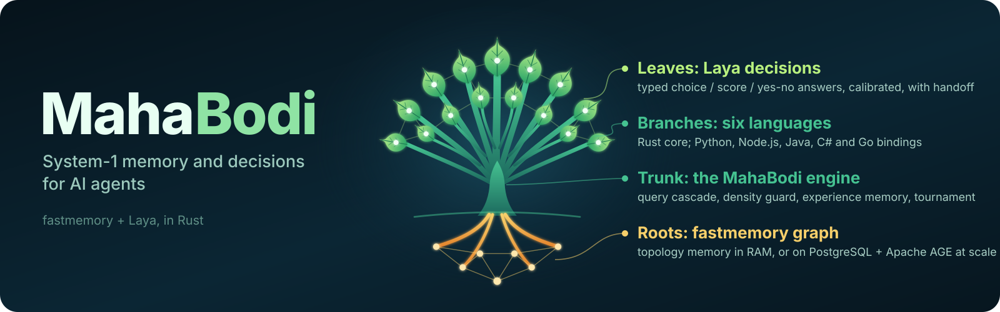
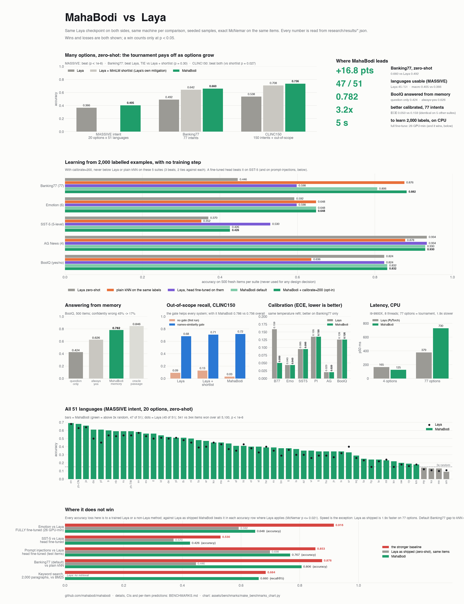
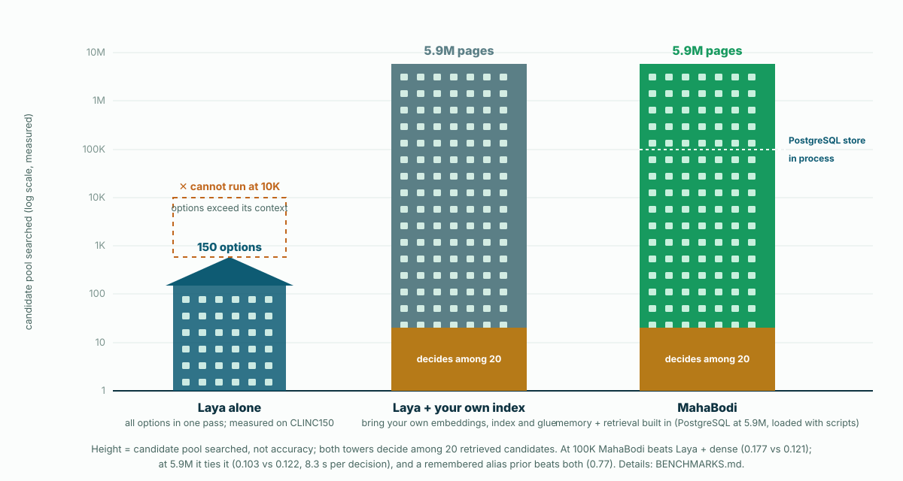

<p align="center">
  
</p>

<h1 align="center">MahaBodi</h1>

<p align="center">
  <b>Memory-driven System-1 decisions for AI agents, built for large option sets.</b><br>
  Typed decisions in one forward pass, with no text generated. Native Rust, six languages.
</p>

<p align="center">
  <a href="https://crates.io/crates/mahabodi"></a>
  <a href="https://pypi.org/project/mahabodi/"></a>
  <a href="https://www.npmjs.com/package/mahabodi"></a>
  <a href="https://www.nuget.org/packages/MahaBodi"></a>
  <a href="LICENSE"></a>
</p>

<p align="center">
  <a href="#install">Install</a> ·
  <a href="#benchmark-highlights">Benchmarks</a> ·
  <a href="#what-it-does">How it works</a> ·
  <a href="#usage">Usage</a> ·
  <a href="#build-and-test">Build</a> ·
  <a href="BENCHMARKS.md">Full results</a> ·
  <a href="Enterprise.md">Enterprise</a>
</p>

---

Agents make many small decisions: which intent, product, entity or tool out of thousands or
millions; whether a ticket matches a known issue; whether a policy passage answers yes. With a
handful of options, you can prompt an LLM. With too many to list, plus the company knowledge needed
to choose between them, the prompt gets long, slow and expensive, and every new option makes it worse.

MahaBodi is built for that case: typed decisions over **many choices, yes/no questions (nouls)
and routing**, informed by a memory of your documents and past labelled decisions.

| | |
|---|---|
| 🎯 **Decisions** | [Laya](https://github.com/NandhaKishorM/laya)'s calibrated `choice` / `score` / `noul` decision model, run natively in Rust through ONNX Runtime. **Tournament shortlisting** handles large option sets (77 to 150 intents measured below). Includes a non-Latin script guard and an answer cache. |
| 🌳 **Memory** | [fastmemory](https://github.com/fastBuilderAI/memory)'s topology memory (ATFs clustered into blocks by Louvain), with a **concept-density guard** and a hybrid **query cascade** that reports how, and whether, every query matched. Decisions can be **grounded** in retrieved passages, and **experience memory** learns from labelled cases instantly, with no retraining. |
| 🏢 **Enterprise path** | Memory on PostgreSQL + Apache AGE + pgvector, sharded by namespace, with models hosted separately ([Enterprise.md](Enterprise.md)). |
| 🧩 **Bindings** | Rust core (`crates/mahabodi-core`) with bindings for **Python, Node.js, Java, C#/.NET and Go**, plus a C ABI. |

### Why MahaBodi

- **Zero tokens generated.** Every decision is a typed answer with a probability for each final candidate, with no
  text to generate or parse. A few options take one model pass; for many options, a tournament runs a few.
  - A 4-option decision takes 125 ms p50 on a CPU, against 165 ms for Laya's PyTorch path; most of that gain comes
    from ONNX Runtime.
  - On 77 options it's 1.9× slower than Laya (730 vs 379 ms).
- **Stronger on many-option routing.** Zero-shot, against Laya as shipped:
  - Banking77 (77 intents): 0.660 vs 0.492, +16.8 points. It ties Laya with a MiniLM shortlist (0.642).
  - CLINC150 (150 intents): 0.786 vs 0.756 for Laya with a shortlist, on fresh items.
- **Multilingual.** Across 51 languages (MASSIVE): 0.405 vs 0.366 macro, against laya-multilingual without its Router.
- **Learns in seconds, no retraining.** `learn()` absorbs 2,000 labelled cases in 1.5–16 s on a CPU.
  - Never below Laya as shipped on 5 fresh suites: 3 beats, 2 ties.
  - Banking77: 0.462 → 0.832. A plain kNN on the same examples scores 0.892.
  - Laya's near-ties (top two options within 0.10): 26 % → 91 % correct.
- **Answers from your documents.** Grounding in memory lifts BoolQ from 0.424 (question only) to 0.782, against
  always-yes at 0.626. Confidently wrong answers fall from 45 % to 17 %.
- **Finds what users mistype.** At 300 paragraphs, misspelled keyword queries find the right passage in the top 5 61 %
  of the time, against 5 % for BM25. At 2,000 paragraphs it ties BM25 on clean queries and loses on keyword queries
  (0.660 vs 0.684).
- **Runs at catalogue scale.**
  - 100K candidate pages: MahaBodi's retrieval beat a dense shortlist, 0.177 vs 0.121, p = 0.0002.
  - 5.9M pages: MahaBodi runs through PostgreSQL and ties Laya + dense, at 8.3 s per decision.
  - A remembered alias prior beat both (details below).
- **Ships in six languages.** A Rust core with bindings for Python, Node.js, Java (built from source), C#/.NET and Go,
  on crates.io, PyPI, npm and NuGet. MIT licensed.
- **Numbers you can check.** Accuracy comparisons run both systems on the same machine and the same items, with an
  exact McNemar test. The later ones were pre-registered: learning from labelled cases, fine-tuning and entity
  linking. Per-item predictions are in the repo, losses are published next to wins (below), and every number is
  recomputed by a second reviewing agent.

### When to use MahaBodi

| Your problem | Best fit | Evidence |
|---|---|---|
| **Thousands to millions of options** (entities, products, tools, codes) | **MahaBodi's memory.** Laya alone can't take 10,000 options. Its retrieval beat a dense shortlist at 100K pages (0.177 vs 0.121), and it ran 5.9M pages through PostgreSQL on one Mac mini, where it tied Laya + dense (numerically lower; 8.3 s per decision). What the memory stores matters most: on AIDA, a simple remembered alias prior beat every system, MahaBodi included (0.78 vs 0.18 at 100K). | [Entity linking at 10K–5.9M](#11-large-option-spaces-entity-linking-over-10k-to-59m-wikipedia-pages) |
| **Many options and no training step**, or labels that change | **MahaBodi.** It learns from labelled cases in seconds and is never below Laya as shipped (5 suites: 3 beats, 2 ties). A plain kNN is a strong alternative: at default settings it beats MahaBodi on Banking77 (0.892 vs 0.832). On another fresh sample, the opt-in `calibrate=200` ties kNN (0.882 vs 0.876). | [Experience memory](#4-experience-memory-learning-from-labelled-examples-without-retraining) |
| A **small, fixed label set** (2–77 labels tested), with labelled data and a GPU for training | **Fine-tune a classifier.** A fully fine-tuned Laya beats MahaBodi on 4 of 6 suites. MahaBodi's advantage there is no training step, and updates take seconds. | [Where it does not win](#where-it-does-not-win-laya-fine-tuned-on-the-same-examples) |

> [!NOTE]
> **What is and isn't measured yet.**
> - **Measured:**
>   - many-option routing (Banking77, 77 intents; CLINC150, 150 intents);
>   - learning from labelled cases;
>   - yes/no answers grounded in memory;
>   - entity linking over 10K and 100K candidate pages in process;
>   - entity linking over 5.9M pages (23M passages) through the PostgreSQL store on one Mac mini (8.3 s per decision,
>     p50).
> - **Not yet measured:**
>   - accuracy against an LLM given every option in its context (the claim here is cost and
>     latency: one forward pass, zero tokens);
>   - tool routing across hundreds of tools;
>   - the PostgreSQL design at TB scale.
> - **Out-of-scope detection** is opt-in in `decide()` and off by default. It is a
>   names-similarity gate tuned at the test prevalence, and it raises out-of-scope recall to
>   ~72 % on fresh CLINC150 items. It reproduces the benchmark exactly (all 1,600 items on Ubuntu
>   with the final build). The same gate helps every system, and it costs in-scope accuracy.

## Install

| Language | Command | Registry |
|---|---|---|
| Rust | `cargo add mahabodi` | [crates.io](https://crates.io/crates/mahabodi) (also `mahabodi-core`, `mahabodi-ffi`) |
| Python | `pip install "mahabodi[laya]"` | [PyPI](https://pypi.org/project/mahabodi/) |
| Node.js | `npm install mahabodi` | [npm](https://www.npmjs.com/package/mahabodi) |
| C# / .NET | `dotnet add package MahaBodi` | [NuGet](https://www.nuget.org/packages/MahaBodi) |
| Go | `go get github.com/mahabodi/mahabodi/bindings/go@v0.1.2` | build the native library with Cargo first |
| Java | build from source ([below](#build-from-source-node-java-c-go)) | Maven Central: not yet published |

**Status: alpha.**
- **Versions:** 0.1.2 on crates.io, PyPI, npm and NuGet, and Go v0.1.2 (git tag `v0.1.2`). Java is not on Maven Central.
- **New in 0.1.2:** parallel ingest (100K pages in 3.2 min instead of 55 on a 20-thread i9, at ~1/3 more peak RAM; identical memory verified at 10K and 30K pages) and 3–5× faster queries at 30K–100K pages, with deterministic ranking (bug fix: near-tied hits could swap between runs).
- **Platforms:** prebuilt binaries for Linux x86_64 and macOS x86_64 only.
- **Model weights are not included.** Export them with `research/export_onnx.py`.
- fastmemory's parser and inline Louvain are vendored verbatim (MIT, rev `a7dec441`).

> [!WARNING]
> **Known issue:** the Linux binaries in npm 0.1.0 and NuGet 0.1.0 need glibc 2.39 or newer, so
> they don't load on Ubuntu 22.04, Debian 12 or RHEL 9. 0.1.1 and later are built for glibc 2.28 and fix
> this (0.1.2 was install-tested on Debian 11, Ubuntu 20.04 and Ubuntu 22.04). The PyPI wheels were already built for glibc 2.28.

> [!WARNING]
> **Known issue (0.1.2 and earlier): prose that looks like fastmemory markup can overwrite other documents.**
>
> - **Trigger:** the vendored fastmemory parser reads any `(Component|Block|Function|Data|Access|Event <name>)` in
>   ingested text as structured markup. It even does this inside ordinary prose.
> - **What happens:** such a document is stored as ATFs keyed by the bare name, with no passages. The title and
>   passage text of that document are no longer retrievable.
> - **Collision:** a later document that yields the same name, in the same batch or a later ingest call, silently
>   replaces it.
> - **Seen in:** the KILT Wikipedia pages "Kwun Tong Garden Estate" (text contains `(Block 4)` → a single ATF with id `4`)
>   and "Yau Tong Estate" (`(Block A)` → id `A`). A 2-document test confirmed the overwrite: two pages that both parse
>   to `4` leave one ATF holding the second page's text.
> - **Scale:** measured on all 5,903,530 KILT Wikipedia abstracts, 51 pages were affected. Their text collapsed into
>   32 shared ids, so at least 19 pages share an id with another page (merged or overwritten). One further page had
>   no passage because it has no text at all
>   (`research/results/el_pg_affected_causes.json`).
> - **Workaround until it's fixed:** avoid those parenthesised forms in free text, or give each document a unique
>   `source` and check `snapshot()` for ATF ids that don't start with it.
> - **Fixed on `main`, not yet released (planned for 0.2.0):** the default `format="auto"` no longer parses entity
>   tags, so such text stays a passage scoped to its `source`. fastmemory markup is parsed only with
>   `format="entity_tags"`. In that mode, identical tag names in different documents still merge into one ATF, by
>   design. This changes the default behaviour for anyone relying on auto-detected tags.

## Benchmark highlights

<p align="center">
  
</p>

<p align="center"><sub>Every number in the chart is read from <code>research/results/*.json</code> by
<a href="assets/benchmarks/make_benchmarks_chart.py">make_benchmarks_chart.py</a>; losses are shown too.</sub></p>

Every figure below comes from [BENCHMARKS.md](BENCHMARKS.md). Both sides run on the same machine
with the same Laya checkpoint, on seeded test samples (n = 500 per suite unless noted), with an
exact McNemar test on the same items. A result counts as a **beat** only at p < 0.05.

### At a glance

| Result | Laya (or baseline) | MahaBodi | Verdict (exact McNemar) |
|---|---|---|---|
| MASSIVE intent, 51 languages, zero-shot | 0.366 macro, 45/51 languages usable | **0.405 macro, 47/51 usable** | ✅ **beat**, p < 1e-6 |
| Banking77 (77 intents), zero-shot | 0.492 | **0.660** | ✅ **beat**, p < 1e-6 (tie vs Laya + MiniLM shortlist) |
| Banking77 with 2,000 labelled examples, default settings, fresh items | 0.462 (zero-shot) | **0.832** | ✅ **beat**, different setting; a plain kNN over the same examples scores 0.892: ❌ **loss** |
| Banking77 with 2,000 labelled examples, opt-in `calibrate=200`, third fresh sample | 0.446 (zero-shot); plain kNN 0.876 | **0.882** | ✅ **beat** Laya; 🟰 **ties** kNN (p = 0.63) |
| Experience memory, default, 5 suites, fresh items | Laya zero-shot | no suite below Laya | 3 beats, 2 ties |
| Misspelled keyword retrieval (SQuAD, 300 paragraphs) | baseline BM25: 0.05 recall@5 (Laya does no retrieval) | **0.61** | ✅ **beat** |
| CLINC150 intent routing (150 intents + out-of-scope), zero-shot | 0.708 (Laya + MiniLM shortlist); Laya alone 0.538 | **0.736** | ✅ **beat**, p = 0.027 (one run, 1,000 items); out-of-scope recall only 3 % in that run |
| CLINC150 re-test on fresh items, with the same out-of-scope gate given to every system | 0.756 (Laya + MiniLM shortlist + gate) | **0.786** | ✅ **beat**, p = 0.014; the gate lifts out-of-scope recall to 68–72 % for **all** systems (opt-in `decide()` option; reproduces the benchmark exactly, all 1,600 items on Ubuntu with the final build) |
| BoolQ answered from memory (question only in, passage retrieved) | 0.424 (question only); always-yes 0.626 | **0.782** | ✅ **beat** both, p < 1e-6; below the oracle passage (0.846) |
| 6 other Laya suites, zero-shot | = | = | 🟰 tie: exact parity |
| Latency, CPU only, same Ubuntu i9-9900X box, 8 threads, p50 | Laya PyTorch 165 ms (4 options); 379 ms (77) | **125 ms** (4 options); 730 ms (77) | faster on 4 options (mostly ONNX Runtime); ❌ **slower** on 77 (tournament) |
| Calibration (ECE after the same temperature refit), 6 suites | Banking77 0.159 | Banking77 **0.050** | ✅ **beat** on Banking77 only (tournament); 🟰 tie on 5 |
| Entity linking, 100K candidate pages (AIDA, 1,000 mentions) | 0.121 (Laya + dense shortlist); Laya alone cannot run | **0.177** | ✅ **beat**, p = 0.0002: a retrieval gain; the deciders tie on the same shortlist |
| Entity linking, 10K candidate pages | 0.387 (Laya + dense shortlist) | 0.384 | 🟰 tie (p = 0.92) |
| Entity linking, 5.9M candidate pages (MahaBodi via the PostgreSQL store) | 0.122 (Laya + dense shortlist) | 0.103 | 🟰 tie (p = 0.14), numerically lower; 8.3 s p50 per decision on a Mac mini |
| Entity linking, context-free alias prior (10K / 100K / 5.9M) | prior: 0.800 / 0.784 / 0.772 | 0.384 / 0.177 / 0.103 | ❌ **loss**: the prior beats every context-reading system |

**Zero-shot scorecard** against Laya's 10 published benchmarks: **2 beats, 6 ties**. All 10 are
now measured; the other two are calibration and latency:
- **Calibration (ECE)** is scored per suite: better on Banking77 only, where the tournament changes
  the predictions, and identical on the other 5.
- **Latency** (CPU, one Ubuntu machine): faster on a 4-option decision, mostly thanks to ONNX
  Runtime; **slower** on 77 options, where the tournament runs about 4 passes.

Neither calibration nor latency is counted as an algorithmic beat. MahaBodi runs Laya's own
models: the wins come from how MahaBodi uses them (tournament shortlisting, experience memory,
retrieval), not from a new model.

### 1. Multilingual, zero-shot: MahaBodi beats Laya on Laya's own 51-language benchmark

On MASSIVE intent (20 options, 100 utterances in each of 51 languages, Laya's own construction),
with the `laya-multilingual` checkpoint on both sides:

| | Laya | MahaBodi |
|---|---|---|
| macro accuracy | 0.366 | **0.405** |
| languages above 3× random | 45 / 51 | **47 / 51** |

The difference is significant: exact McNemar over all 5,100 items, 541 vs 344 discordant,
p < 1e-6. The Laya column reproduces Laya's published figures exactly (0.366 and 45/51). The gain
comes from tournament shortlisting, whose settings were fixed on English Banking77 and not tuned
on MASSIVE. Its cost is 4 model passes per decision, against Laya's 1.
[Details →](BENCHMARKS.md#massive-intent-20-options-per-language-laya-multilingual-checkpoint-on-both-sides)

### 2. Many-option decisions, zero-shot: +16.8 points over Laya on Banking77

On 77 intents, MahaBodi's tournament shortlisting scores **0.660 against Laya's 0.492**
(p < 1e-6). It also beats two of Laya's own documented mitigations: a 512-token head budget
(0.564) and shortlisting with Laya's encoder (0.268). It **ties** Laya's shortlist with a MiniLM
embedder (0.642, p = 0.30), which is also faster.
[Details →](BENCHMARKS.md#banking77-mahabodi-vs-layas-own-many-option-mitigations)

### 3. Exact Laya parity, natively in Rust

On the other six published suites MahaBodi reproduces Laya's decisions item for item, with zero
disagreements:

| typed-decisions | AG News | Emotion | SST-5 | prompt-injections | BoolQ |
|---|---|---|---|---|---|
| 0.766 | 0.934 | 0.604 | 0.350 | 0.698 | 0.846 |

These are ties by construction, not wins. [Details →](BENCHMARKS.md)

### 4. Experience memory: learning from labelled examples without retraining

Given 2,000 labelled examples per task (a different setting from zero-shot), the **default**
MahaBodi matches or beats Laya everywhere it was tested on fresh data: **no loss on any of five
suites**. Memory changes an answer only when Laya is unsure, or when nearly all similar stored
cases agree and the task's memory has proven reliable. A plain kNN over the same examples is
**still better on Banking77**.

Fresh test items (500 per suite, never scored before; defaults `experience_override_agree` 6):

| Suite | Laya (zero-shot) | MahaBodi default + memory | plain kNN on same examples |
|---|---|---|---|
| Banking77 | 0.462 | **0.832** (beat, p < 1e-6) | 0.892 (**MahaBodi loses**, p < 0.001) |
| Emotion | 0.574 | **0.612** (beat, p = 0.009) | 0.590 (tie) |
| SST-5 | 0.334 | **0.392** (beat, p = 0.005) | 0.370 (tie) |
| AG News | 0.916 | 0.920 (tie) | 0.892 (MahaBodi beats) |
| BoolQ | 0.838 | 0.836 (tie) | 0.648 (MahaBodi beats) |

prompt-injections was not fresh-tested (its 116 test items were all used earlier). With settings
tuned per task instead of one default, the first test set (items 0–499) gives Banking77 0.888,
Emotion 0.668, SST-5 0.430 and prompt-injections 0.767, all against Laya's 0.492, 0.604, 0.350
and 0.698.
[Details →](BENCHMARKS.md#with-experience-memory-a-different-setting-uses-labelled-examples) ·
[Fresh test →](BENCHMARKS.md#fresh-sample-test-margin-gate-and-agreement-override-items-never-scored-before)

#### Opt-in: `learn(..., calibrate=200)` closes the Banking77 gap

MahaBodi runs Laya on 200 of the labelled cases and compares it with the memory's own
leave-one-out accuracy. Where memory is clearly better, it answers from memory. On a third fresh
sample (500 new items per suite) it was **never below Laya or plain kNN on any of 5 suites**:
3 beats and 2 ties against each. On Banking77 it **matches** kNN (0.882 vs 0.876, p = 0.63) by
answering every item from the memory's kNN. This is MahaBodi switching to kNN where calibration
shows kNN is better, not a new method beating kNN.
- The switching margin (0.2) was picked after seeing the validation grid, for robustness, and was
  fixed before this test.
- prompt-injections was not fresh-tested.
- The AG News and BoolQ tuning items come from Laya's training mix.
- Calibration costs 200 extra decisions per `learn()` and is **off by default**. Without it,
  Banking77 stays at 0.806, below kNN.

[Details →](BENCHMARKS.md#opt-in-calibration-learn-calibrate200-third-fresh-sample-items-never-used-before)

### 5. Breaking Laya's near-ties

When Laya's top two options are within 0.10 of each other it is only 17–42 % accurate. Labelled
memory fixes most of these: Banking77 near-ties go from **26 % to 91 %** and SST-5 from 18 % to
33 %, both significant.
[Details →](Enterprise.md#6-accuracy-hallucination-and-near-ties-what-grounding-does-and-does-not-guarantee)

### 6. Typo-tolerant memory retrieval

On held-out SQuAD questions, hybrid retrieval finds the right passage in the top 5 for **61 % of
misspelled keyword queries, against 5 % for BM25** (300 paragraphs; 40 % against 1.5 % at
2,000). On clean questions it beats BM25 at 300 paragraphs (0.973 vs 0.952) and ties it at 2,000.
On plain keyword queries at 2,000 paragraphs it **loses** to BM25. Confidently wrong answers
remain on hard queries.
[Details →](BENCHMARKS.md#memory-retrieval-held-out-squad-validation-questions-a-hub-fallback-counts-as-a-miss)

### 7. Decisions grounded in memory

Grounding decisions in MahaBodi memory lifts Laya on BoolQ from **0.424** (question only) to
**0.782**, significantly above always answering yes (0.626). Confidently wrong answers fall from
45 % to 17 %. It does not reach the oracle passage (0.846). Memory held each question's own
passage among 500, so this is retrieval over a relevant knowledge base, not open-domain QA. The
passage format was chosen on a separate dev sample.
[Details →](BENCHMARKS.md#grounded-decisions-boolq-answered-from-mahabodi-memory-english-laya-checkpoint)

### 8. Intent routing at 150 intents (CLINC150), a new use case

MahaBodi routes to the right intent more often than Laya with a MiniLM shortlist, the fair
baseline: overall accuracy **0.736 vs 0.708** (p = 0.027, a single run on 1,000 of 5,500 test
items; Laya alone 0.538). In-scope accuracy is 0.876 vs 0.824.

Out-of-scope detection did **not** work in that run: MahaBodi flagged 3 % of out-of-scope
requests. A likely reason is that its thresholds were tuned on validation data that is only ~4 %
out-of-scope, against 18 % in test. A pre-registered re-test on 1,000 fresh items gave every
system the same names-similarity gate, tuned at the test prevalence.
- Out-of-scope recall rose to 68–72 % for **all** systems, so that gain is not specific to
  MahaBodi.
- MahaBodi still wins on overall accuracy: 0.786 vs 0.756, p = 0.014.
- The gate costs in-scope accuracy (0.802 here).
- It was measured as a recipe in the benchmark script. It is now built into `decide()` as an
  opt-in option (off by default). It reproduces the benchmark's out-of-scope decisions exactly:
  - on Ubuntu, all 1,600 items on the final build;
  - on macOS, all 1,600 items on the build before a final safety fix, and 600 items on the final
    build.

[Details →](BENCHMARKS.md#new-use-case-intent-routing-with-out-of-scope-clinc150-plus-150-intents--oos)

### 9. Calibration

Measured with Laya's own protocol (ECE after a temperature refit on validation data), MahaBodi is
identical to Laya on 5 suites. It is better on Banking77 (0.050 vs 0.159), where the tournament
changes the predictions. Mean ECE is 0.078 vs 0.096, and all of that gap is Banking77. Not
compared with Laya's published 0.081 (its suite mix is unknown).
[Details →](BENCHMARKS.md#calibration-ece-as-a-scored-row)

### 10. Latency

This is one run, CPU only, on one Ubuntu i9-9900X machine, with 8 threads for both systems.
- On a 4-option decision MahaBodi (Rust + ONNX Runtime) is faster than Laya's default PyTorch
  path: p50 125 vs 165 ms. Much of that comes from ONNX Runtime; Laya's own ONNX export measured
  140 ms (not thread-matched).
- On 77 options MahaBodi's tournament is about 1.9× **slower**: 730 vs 379 ms.
- Laya's published 32.8 ms is on a T4 GPU and is not compared.

[Details →](BENCHMARKS.md#latency-cpu-only-same-machine-batch-1)

### 11. Large option spaces: entity linking over 10K to 5.9M Wikipedia pages

Which Wikipedia page does a mention in a news article refer to? Each system chooses among a pool of 10K, 100K
or all 5.9M KILT Wikipedia pages. The setup:
- 1,000 AIDA test mentions, the same at every pool size;
- settings selected on dev mentions only;
- pre-registered in [`research/PREREG_MILLION_SCALE.md`](research/PREREG_MILLION_SCALE.md);
- every clarification pushed before the test ran.

<p align="center">
  
</p>

**Laya alone cannot run at any of these sizes:** 10,000 options do not fit in its context. So Laya gets a shortlist
from a dense-vector index (the fair baseline).

| Candidate pages | Laya + dense shortlist | MahaBodi | Laya on MahaBodi's shortlist | Alias prior (no context) |
|---|---|---|---|---|
| 10K | 0.387 | 0.384 (🟰 tie) | 0.315 | **0.800** |
| 100K | 0.121 | **0.177** (✅ beat, p = 0.0002) | 0.194 | **0.784** |
| 5.9M | 0.122 | 0.103 via the PostgreSQL store (🟰 tie, p = 0.14) | 0.107 | **0.772** |

**How to read the table:**
- **Where MahaBodi's 100K win comes from:** retrieval, meaning its matching cascade (exact → substring → stem → fuzzy)
  plus a vector per passage; the graph's blocks don't rank results. The right page is in MahaBodi's top 20 for 68% of mentions,
  against 37% for the dense shortlist. Given the same shortlist, Laya and MahaBodi's decider tie (p = 0.28).
- **At 10K the pattern flips:** Laya does worse on MahaBodi's shortlist than on the dense one, even though MahaBodi's
  shortlist holds the answer more often. The cause is not isolated; harder distractors are one explanation. There,
  MahaBodi's decider beats Laya's (p = 0.0003).
- **❌ Loss: the alias prior beats every system that reads the context,** at every pool size. The alias prior is the
  entity each mention string most often referred to in training data.
- **❌ Loss: MahaBodi's alias memory doesn't close that gap.** It stores (name → entity) pairs from training data as
  candidates, and it is far below the prior (0.234 vs 0.784 at 100K).
- **At 5.9M pages MahaBodi runs through the PostgreSQL store,** because in-process memory can't hold 5.9M pages. It ties
  Laya + dense (0.103 vs 0.122, p = 0.14, numerically lower). It takes 8.3 s per decision (p50) on one Mac mini; 4.7 s
  of that is text search over 23M passages.
- **Limitation:** at 100K, the PostgreSQL path shows no significant difference from in-process MahaBodi (0.152 vs 0.177,
  p = 0.11), but its shortlist holds the answer far less often (48% vs 68%). That's because of the pre-registered
  one-vector-per-page setup, so the 5.9M number understates in-process retrieval by an unknown amount.
- **❌ Loss: on the alias shortlist at 5.9M, Laya's decider beats MahaBodi's** (0.319 vs 0.274, p = 0.006).
- **The lesson for large option spaces:** what the memory holds and retrieves matters more than the decision model.

[Details, all arms and disclosures →](BENCHMARKS.md#entity-linking-at-10k-100k-and-59m-candidates-kilt-aida-pre-registered)

### Where it does not win: Laya fine-tuned on the same examples

MahaBodi needs no training step. A Laya **fine-tuned** on the same 2,000 labelled examples is a
stronger opponent, and where it wins that is reported as a loss.

**Head only (encoder frozen)**, compared on the fresh items:

| Suite | MahaBodi default | Fine-tuned head | Verdict |
|---|---|---|---|
| Emotion | **0.648** | 0.598 | ✅ beat |
| Banking77 | **0.806** | 0.598 | ✅ beat |
| AG News, BoolQ | | | 🟰 tie, also when the fine-tune is selected on clean validation items (not from Laya's training mix); there the fine-tuned head does not beat zero-shot Laya either |
| SST-5 | 0.426 | **0.530** | ❌ loss: on that 5-level sentiment scale, training learns what memory does not |
| prompt-injections | 0.767 | **0.853** | ❌ loss, measured on the 116 test items only, where MahaBodi's settings were also tuned |

The BoolQ and prompt-injections numbers come from a re-run. The first GPU run was invalid because
of a PyTorch attention bug that produced NaN on padded inputs; an earlier version of this text
wrongly blamed hardware drift.
[Details →](BENCHMARKS.md#against-laya-fine-tuned-on-the-same-labelled-examples-head-only-encoder-frozen)

**Fully fine-tuned (encoder too).** This took 10–110 GPU-minutes per suite on an RTX 2080 Ti;
MahaBodi's `learn()` takes seconds on a CPU.

| Suite | MahaBodi default | Fully fine-tuned Laya | Verdict |
|---|---|---|---|
| Emotion | 0.648 | **0.916** | ❌ loss |
| SST-5 | 0.426 | **0.558** | ❌ loss |
| prompt-injections (test items only) | 0.767 | **0.974** | ❌ loss |
| Banking77 | 0.806 | **0.852** | ❌ loss; with `calibrate=200` it ties (0.882, p = 0.096), and plain kNN also ties the fine-tuned model |
| AG News | 0.930 | 0.934 | 🟰 tie |
| BoolQ | 0.832 | 0.822 | 🟰 tie |

AG News and BoolQ were selected on clean validation items, since the usual ones come from Laya's
training mix. On these two suites full fine-tuning did not beat zero-shot Laya on fresh items
either.

On 4 of the 6 suites a fully fine-tuned Laya is more accurate than MahaBodi's default. It ties on
AG News and BoolQ, and `calibrate=200` ties it on Banking77. **Where GPU training is affordable
and labels are stable, fine-tune.** MahaBodi's advantages:
- no training step (seconds on a CPU, against 10–110 GPU-minutes);
- instant updates when labels change;
- never below Laya as shipped on accuracy (it is slower on 77 options).

[Details →](BENCHMARKS.md#against-laya-fully-fine-tuned-on-the-same-labelled-examples-encoder--head)

### Optional: a trained Laya head inside MahaBodi

Can a fine-tuned head be used *as a component* of MahaBodi? Three candidates per suite: the shipped
MahaBodi (**A**, no training), the fine-tuned head alone (**B**), and the head + MahaBodi memory
(**C**). One is chosen on a separate selection set (A is kept unless another beats it by at least
1 point), then tested once on a fourth fresh sample of 500 items. The protocol was pre-registered.

| Suite | Chosen | Training step? | Chosen vs fine-tuned head | vs plain kNN |
|---|---|---|---|---|
| Emotion | C: head + memory | yes | ✅ 0.696 vs 0.614, p < 1e-4 | 🟰 tie |
| Banking77 | A: shipped MahaBodi | no | ✅ 0.884 vs 0.606, p < 1e-6 | 🟰 tie |
| AG News | B: the head itself | yes | 🟰 tie by construction | ✅ beat |
| BoolQ | A: shipped MahaBodi | no | 🟰 0.848 vs 0.840, p = 0.48 | ✅ beat |
| SST-5 | C: head + memory | yes | ❌ **loss**, 0.440 vs 0.494, p = 0.027 | ✅ beat |

- **Headline:** with its optional trained-head mode, MahaBodi matched or beat a fine-tuned Laya head
  on 4 of 5 fresh suites.
- **SST-5 was a selection miss.** Its selection rule chose memory + head, which lost to the head
  alone.
- **Emotion:** the win is *trained head + memory* against the trained head alone; it is not
  MahaBodi without training beating fine-tuning. Memory added on top of training on Emotion and
  Banking77.
- **Selection sets:** for AG News and BoolQ they come from Laya's training mix, so the choice
  there is weak evidence. Neither verdict depends on it.
- **Prompt injections** (test items only, no fresh sample): the fine-tuned head 0.862 vs shipped
  MahaBodi 0.767 (p = 0.043); head + memory 0.853 ties the head.

[Details →](BENCHMARKS.md#a-trained-laya-head-as-a-mahabodi-component-fourth-fresh-sample)

Deploying at TB/PB scale on PostgreSQL + Apache AGE with separately hosted models is covered in
[Enterprise.md](Enterprise.md).

## What it does

```text
text / ATF markdown / fastmemory entity tags
        │ ingest (ATF sections auto-detected; entity tags opt-in; never drops content)
        ▼
fastmemory ATFs ──► edges (fastmemory's rule + context links + density concepts)
        │                 │
        │                 └─► Louvain communities (deterministic port of fastmemory's inline Louvain)
        ▼
concept-density guard ──► BM25 / stem / trigram index
        │
        ▼
query cascade: exact → substring (fastmemory rule) → stem → fuzzy → hub
   every result says matched / handoff / stage / confidence
        │
        ▼  context (empty on handoff — never grounds a decision on unrelated memory)
Laya decision (ONNX, Rust) ──► typed answer + probabilities + confidence (+ handoff flags)
```

### Memory: density guard and "queries never fail", made precise

fastmemory's Rust parser only reads entity tags such as `(Function Validate_Token)`. Its own
README format (`## [ID: x]` + `**Action:**` fields) and plain prose parse to *zero* ATFs, and
ATFs without data/access/event links are dropped by its Louvain step. Either way, queries on
that memory find nothing. MahaBodi:

* ingests all three input shapes (ATF sections are detected per region; fastmemory entity tags
  only with `format="entity_tags"`), and falls back to prose so content is never lost;
* keeps every ATF as a node, even when it has no edges;
* measures concept density (isolated ATFs, links per ATF, and a self-probe that asks whether
  each ATF is found by its own rarest term) and repairs it by linking under-connected ATFs to
  shared concept nodes;
* answers every query on a non-empty memory, but **never pretends**: each result carries
  `matched`, `handoff` (hand this to System 2) and `stage`. A `hub` fallback, a query with no
  content terms, or one that covers under half of its terms is flagged `handoff: true`, and
  `context()` returns nothing for it.

"Never fails" therefore means *never errors and never silently returns an unrelated answer as
a match*. Retrieval quality is measured separately on held-out questions
(`research/bench_retrieval.py`).

### Decisions: Laya, natively

`predict()` reproduces Laya's English checkpoint exactly: token ids are identical and every
probability is within 2e-4 of Laya's PyTorch model on the golden parity cases
(`cargo test -p mahabodi-core --release --test laya_parity -- --ignored`). `decide()` adds:

* **Tournament shortlisting.** Laya gives all options of a question one shared token budget,
  so at 77 labels each label keeps about 4 tokens. MahaBodi scores the options in groups,
  keeps the top options of each group, and decides among the finalists. It costs more model
  rows per decision; the benchmarks report both accuracy and rows.
* **A non-Latin script guard.** The English checkpoint is never run on text it cannot read.
  Such answers come back with a `null` decision and `handoff: true`. This is a *subset* of
  Laya's Router: Latin-script non-English text is not detected.
* **An answer cache,** plus an optional adaptive option-order ensemble. The ensemble is off by
  default because it showed no gain on validation data.
* **Experience memory** (`learn(states, questions, labels)`, then ordinary `decide()`; needs
  `load_embedder`). Labelled past cases are stored per question. By default memory changes an
  answer only when Laya's top-two margin is below 0.5 (`experience_below_margin`), or when at
  least 6 of the 8 nearest cases agree (`experience_override_agree`) and the task's memory scores
  at least 0.6 in its own leave-one-out check (`experience_override_min_trust`). Otherwise Laya's
  answer stands. The answer's `bodi.experience.override` field says when memory decided.
  * **Cost:** each `learn()` call recomputes that leave-one-out estimate for the question it
    touched. It probes at most 2,000 cases, each against all n stored cases:
    O(min(n, 2000) · n · 384). That is fine up to tens of thousands of cases. Around 10^6 cases it
    needs an approximate nearest-neighbour index or an incremental estimate, which is not built
    yet.
  * *Experimental, off by default:* `learn(..., calibrate=N)` also runs Laya on up to N of the
    labelled cases, which costs N extra decisions. It compares Laya's accuracy there with the
    memory's leave-one-out accuracy. Where memory is clearly better, `decide()` answers from
    memory (`bodi.experience.memory_first`). Calibrate on data Laya was not trained on: on its
    training data, Laya's accuracy is inflated and memory-first will not switch on.
* **Grounded decisions** (`decide_with_memory`). It retrieves from memory and adds the context to
  the state. `style="passages"` passes the top 3 passages under a `passage` key before the other
  fields; it was chosen on a BoolQ dev sample and is the better format there. The default,
  `"labelled"`, keeps the older `memory` key format. On a retrieval handoff no context is added.

## Usage

**Python** (`bindings/python`, `maturin develop --release`)

```python
from mahabodi import Bodi

b = Bodi()
b.ingest(open("kb.md").read(), source="kb")
r = b.query("refund policy")                 # r["matched"], r["handoff"], r["stage"], r["hits"]

b.load_laya("models/laya-v2")
b.decide("I was charged twice", {"refund": {"type": "noul", "instructions": "Asks for a refund?"}})
b.decide_with_memory("I was charged twice", {...}, query="duplicate charge refund")
```

| Language | Build / test | Minimal call |
|---|---|---|
| **Node.js** | `bindings/node`, `npm run build` | `const { Bodi } = require('mahabodi')`; model calls return Promises and run off the event loop |
| **Java** | `bindings/java`, `mvn test` | `try (Bodi b = new Bodi()) { b.query("refunds", 5); }`, with JSON strings in and out |
| **C#** | `bindings/csharp`, `dotnet test` | `using MahaBodi; using var b = new Bodi(); b.Query("refunds");` |
| **Go** | `bindings/go` | `e, _ := mahabodi.New(nil); r, _ := e.Query("refunds", 5)`; cgo links `target/release/libmahabodi` |
| **C** | `crates/mahabodi-ffi/include/mahabodi.h` | four functions, JSON in and out |

### PostgreSQL store (on `main`, unreleased, planned for 0.2.0)

For memories too large for one process (millions of passages), MahaBodi can keep memory in PostgreSQL. It is built
with the cargo feature `postgres`. It stores the same passages, graph nodes and term statistics as in-process memory,
and searches with the same cascade:

- exact, substring, stem, typo-corrected;
- spreading through the graph's nodes;
- per-passage vectors.

You bring a PostgreSQL 16/17 server with pgvector and pg_trgm (see [deploy/postgres](deploy/postgres/)).

```python
b = Bodi()
b.load_embedder("models/minilm")
b.store_open("host=127.0.0.1 port=5432 user=postgres dbname=mahabodi", namespace="kb")
b.store_ingest_batch([{"text": "...", "source": "doc1"}, ...])  # repeat per batch
b.store_build_index()
b.store_ensure_density()          # once after loading
b.store_query("refund escalation", k=20)
```

- **Tested:** the store returns the same top-20 results, scores, stage and handoff as the in-process engine on test
  fixtures (`crates/mahabodi-core/tests/store_pg.rs`, passing on the current code). The pre-registered parity check
  on the dev 100K pages passed at cc3a70a: accuracy 0.198 and shortlist recall 0.708, the same as in-process
  (`research/results/store_parity_gate_attempt1.json`). It used exact vector search and ran before store schema 2.
  The 5.9M re-run is still pending
  ([`research/PREREG_SCALE_V2.md`](research/PREREG_SCALE_V2.md)).
- **Not yet in the store:** experience memory (`learn`, `calibrate`), which stays in process.
- **Differences from in-process:**
  - an unmatched query is an empty handoff (no hub fallback);
  - density runs when asked, not after every ingest.
- **Fork safety:** a forked child opens its own connections. This is tested in
  `bindings/python/tests/test_store_pg.py`, which passes against PostgreSQL 17 on macOS arm64. Linux is not yet
  tested.
- **Bindings:** the store is available through every binding's `call()` (`store_*` methods), and is tested from Rust
  and Python only so far.
- **TLS:** the refusal path is tested; a handshake with a certificate-verified server is not yet tested.
- **Vectors:** each namespace has its own vector table and index, `vector` or `halfvec`, with HNSW or IVFFlat.
  Changes are listed in [CHANGELOG.md](CHANGELOG.md).

## Build and test

**Requirements:** Rust 1.88+, libonnxruntime 1.23+ (for decisions), and a Python 3.11 venv (for
model export and benchmarks). Optional, per binding: maturin, Node 18+, JDK 11+ and Maven,
.NET 8 SDK, Go 1.21+.

```bash
python3.11 -m venv .venv && .venv/bin/pip install torch==2.2.2 "numpy<2" transformers==4.57.3 \
    safetensors huggingface_hub onnx onnxruntime==1.23.2 laya
.venv/bin/python research/export_onnx.py --out models/laya-v2       # ~1.7 GB, verified vs PyTorch
./scripts/test_all.sh                                               # every language, real model
```

`scripts/test_all.sh` prints one PASS/FAIL line per suite: native, rust, laya_parity, python,
node, java, csharp and go. All 8 pass on macOS x86_64 (i9-9980HK) and on Ubuntu (i9-9900X).

### Build from source (Node, Java, C#, Go)

Java isn't on Maven Central yet, and the published packages ship prebuilt binaries only for Linux
and macOS x86_64. For Java, or for another platform, build from a clone. Each binding wraps a
native library built with Cargo (Rust 1.88+). ONNX Runtime (`ORT_DYLIB_PATH`) and an exported
Laya model are needed only for decisions; memory works without them. These steps were checked end
to end on Ubuntu x86_64, each package installed into a fresh project; `scripts/test_all.sh` also
covers macOS x86_64.

```bash
git clone https://github.com/mahabodi/mahabodi && cd mahabodi
cargo build --release -p mahabodi-ffi -p mahabodi-jni     # target/release/libmahabodi*.{so,dylib}
```

<details>
<summary><b>Node.js</b></summary>

```bash
cd bindings/node && npm install && npm run build && npm pack     # -> mahabodi-0.1.2.tgz
cd /your/app && npm install /path/to/mahabodi/bindings/node/mahabodi-0.1.2.tgz
# const { Bodi } = require('mahabodi')
```
</details>

<details>
<summary><b>Java</b> (<code>io.github.mahabodi:mahabodi:0.1.2</code>; Java package <code>ai.mahabodi</code>)</summary>

```bash
cd bindings/java && mvn -B install -DskipTests                   # into your local ~/.m2
```

The jar bundles the native library for linux-x86_64 and macos-x86_64 (copy them into
`bindings/java/natives/<os>-<arch>/` before `mvn install`) and loads it automatically. To use
another build, pass `-Dmahabodi.library.path=/path/to/libmahabodi_jni.so`, set
`MAHABODI_JNI_PATH`, or put it on `java.library.path`.
</details>

<details>
<summary><b>C# / .NET 8</b> (package <code>MahaBodi</code>)</summary>

```bash
cd bindings/csharp/MahaBodi && dotnet pack -c Release -o ./nupkg   # bundles the native library
dotnet add /your/app package MahaBodi --version 0.1.2 --source /path/to/mahabodi/bindings/csharp/MahaBodi/nupkg
```

The package contains the native library for the platform you built on (`runtimes/<rid>/native`).
</details>

<details>
<summary><b>Go</b></summary>

In your module's `go.mod`:

```
require github.com/mahabodi/mahabodi/bindings/go v0.0.0
replace github.com/mahabodi/mahabodi/bindings/go => /path/to/mahabodi/bindings/go
```

cgo links `target/release/libmahabodi` relative to that checkout. To link a library stored
elsewhere, set `CGO_LDFLAGS="-L/path/to/lib -lmahabodi"`.
</details>

## Benchmarks

Every number in [BENCHMARKS.md](BENCHMARKS.md) is generated from `research/results/*.json` by
`research/report.py`, and each JSON is produced by one committed script.
- In every comparison, both systems run on the same machine: the macOS i9-9980HK for most suites,
  and the Ubuntu i9-9900X (with an RTX 2080 Ti for fine-tuning) where a result says so.
- Samples are seeded, and tuning uses validation/train splits only.
- Ties and losses are reported as such.
- Laya's published latency (32.8 ms) comes from a T4 GPU and is not comparable to the CPU runs here.

## License

[MIT](LICENSE). MahaBodi runs third-party models and code under their own licenses: Laya's models
and MiniLM are Apache-2.0, fastmemory is MIT. See [THIRD_PARTY_NOTICES.md](THIRD_PARTY_NOTICES.md).
Test fixtures include fastmemory example inputs (MIT; see
`crates/mahabodi-core/tests/fixtures/FASTMEMORY_LICENSE`).
